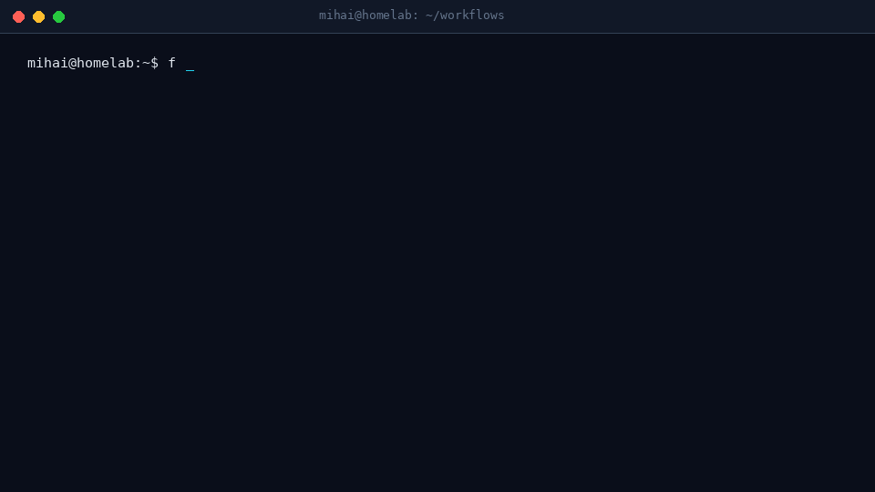

# FlowSentry

[](https://github.com/vasilicasijarvis/flowsentry/actions/workflows/selfscan.yml)

**Security scanner for n8n workflows — 18 rules, zero dependencies, CI-ready.**

FlowSentry parses your n8n workflow JSON exports and flags the failures we keep seeing in
the wild: unauthenticated webhooks, hardcoded secrets, SSRF to cloud metadata, shell
injection through `Execute Command`, eval-style code nodes, SQL built from user input,
over-scoped credentials and more. Output: terminal, JSON, SARIF 2.1.0 (GitHub Code
Scanning) and a self-contained HTML report.

- Zero runtime dependencies (pure Python stdlib, Python 3.9+)
- 18 rules mapped to the OWASP Agentic Top 10 (2026)
- SARIF output → upload straight to GitHub Code Scanning
- Exit code 1 on findings → drop it into CI as a quality gate

```bash
$ pip install git+https://github.com/vasilicasijarvis/flowsentry.git
$ flowsentry scan workflows/ --sarif flowsentry.sarif
```

> PyPI package (`pip install flowsentry`) is coming — for now install straight from GitHub.

**No install at all:**

```bash
git clone https://github.com/vasilicasijarvis/flowsentry
cd flowsentry
python3 flowsentry_cli.py scan ./workflows
```

---

## Why

n8n webhooks are **unauthenticated by default**. Most self-hosted instances sit behind a
single reverse proxy, and one exported workflow is enough to leak a hardcoded API key or
an `Execute Command` node that interpolates request data straight into a shell.

We scanned 10 real, public n8n workflow files from GitHub with FlowSentry v0.1:

| File (source repo) | Critical | Medium | Notable finding |
|---|---|---|---|
| `AI_Bot.json` ([AnaamRasool/WhatsApp-Bot](https://github.com/AnaamRasool/WhatsApp-Bot)) | 1 | 4 | WhatsApp webhook with `authentication: none`, replies echo full node output |
| `00485-library-install.json` ([DragonJAR/n8n-workflows-esp](https://github.com/DragonJAR/n8n-workflows-esp)) | 2 | 1 | Bash script interpolating `{{$json.library}}` into shell |
| `n8n/w1.json` ([Finfra/dockers](https://github.com/Finfra/dockers)) | 1 | 2 | Webhook `authentication: 'none'` |
| `workflows/103.json` ([n8n-io/test-workflows](https://github.com/n8n-io/test-workflows)) | 4 | 2 | `echo 'test' > /tmp/{{$node["Set"].json["filename"]}}` |
| `subagente-citas.json` ([santifer/jacobo-workflows](https://github.com/santifer/jacobo-workflows)) | 1 | 9 | Public appointment-booking webhook, no auth |
| `nl2sql.json` ([Wilsonoonn/n8n_nl2sql](https://github.com/Wilsonoonn/n8n_nl2sql)) | 1 | 9 | Natural-language-to-SQL behind an unauthenticated webhook |
| `api-authentication.json` ([yorrickjansen/n8n-webhook-security](https://github.com/yorrickjansen/n8n-webhook-security)) | 1 | 5 | Demo webhooks themselves accept unauthenticated requests |
| `AIDA Preisalarm`, `nl2sql` helper, `openwebui-pipe` (3 more files) | 0 | 7 | code nodes, missing error handling, response modes |

**Totals: 11 critical, 39 medium across 10 files. 100% of files had at least one finding.**

> These are public workflow exports shared by their authors for learning/demo purposes —
> nothing was exploited and no instance was accessed. FlowSentry is defensive tooling:
> it reads JSON files, it does not send requests.

## Real findings, verbatim

**1. Shell injection via Execute Command (n8n official test workflow):**

```
[!] CRITICAL FS005 Execute Command node without guardrails
    node: Execute Command  (n8n-nodes-base.executeCommand)
[!] CRITICAL FS009 Expression-based command injection
    node: Execute Command
    evidence: echo 'test' > /tmp/{{$node["Set"].json["filename"]}}
    fix: Never interpolate data into commands; use argv-style APIs or strict
         allowlist validation of the entire command string.
```

**2. Unauthenticated webhooks (5 of 10 files):**

```
[!] CRITICAL FS001 Webhook endpoint without authentication
    node: HTTP Trigger  (n8n-nodes-base.webhook)
    Webhook node has authentication set to 'none'. Anyone who can reach the
    n8n instance can trigger this workflow and its downstream actions.
    fix: Set Webhook > Authentication to Basic/Header/JWT auth, or validate a
         shared-secret header in the workflow before doing anything sensitive.
```

**3. What the other rules catch (crafted example from the test suite):**

```
[!] CRITICAL FS002 Hardcoded secret in node parameters
    Parameter 'accessToken' looks like it contains a hardcoded secret
    (literal value, no expression). Exports of workflows leak like this.
    fix: Move the value into an n8n credential and reference it via expressions.
```

Rules FS002–FS004, FS011–FS013 and FS015–FS018 (secrets, SSRF/IMDS, SQL injection,
plain http, community nodes, exfil sinks) did not fire on this particular sample but are
fully covered by the 30-test suite in [`tests/test_rules.py`](tests/test_rules.py).

Full machine-readable results: [`examples/scan_report.json`](examples/scan_report.json),
[`examples/scan_report.sarif`](examples/scan_report.sarif) and
[`examples/scan_report.html`](examples/scan_report.html).

## Rules (v0.1)

| Rule | Severity | Detects |
|---|---|---|
| FS001 | critical | Webhook endpoint without authentication |
| FS002 | critical | Hardcoded secret in node parameters |
| FS003 | high | Hardcoded secret in HTTP header/query |
| FS004 | critical | SSRF / cloud metadata endpoint access (IMDS 169.254.169.254, GCP, Alibaba) |
| FS005 | critical | Execute Command node without guardrails |
| FS006 | medium | Code node without sandbox hardening (no task runners) |
| FS007 | critical | Dynamic code construction (eval, new Function, child_process, os, subprocess, dynamic `$()`) |
| FS008 | medium | Credential over-scoping (admin/root/owner names, unusual types) |
| FS009 | critical | Expression-based command injection (`{{$json...}}` into shell) |
| FS010 | medium | Missing error handling (no errorWorkflow, no Error Trigger) |
| FS011 | high | Raw SQL built from expressions |
| FS012 | high | HTTP node over plain `http://` |
| FS013 | medium | Exposed trigger (Form/Telegram/IMAP accepting unauthenticated input) |
| FS014 | medium | Credential reuse across 5+ nodes |
| FS015 | medium | Community/unknown node packages |
| FS016 | medium | Data sent to exfil-style sinks (webhook.site, pastebin, ngrok…) |
| FS017 | medium | Webhook response mode echoing internal data |
| FS018 | medium | Set node storing secrets in plaintext |

## Usage

```bash
# Scan files or directories (directories are walked for *.json)
flowsentry scan ./workflows
flowsentry scan export1.json export2.json

# Machine-readable outputs
flowsentry scan ./workflows --json report.json --sarif report.sarif --html report.html

# CI gate: exit 1 when findings at/above severity exist (default: high)
flowsentry scan ./workflows --fail-on critical
flowsentry scan ./workflows --fail-on never   # always exit 0

# List rules
flowsentry rules
```

### GitHub Actions

```yaml
name: flowsentry
on: [push, pull_request]
jobs:
  scan:
    runs-on: ubuntu-latest
    steps:
      - uses: actions/checkout@v4
      - uses: actions/setup-python@v5
        with: { python-version: "3.12" }
      - run: pip install git+https://github.com/vasilicasijarvis/flowsentry.git
      - run: flowsentry scan ./workflows --sarif flowsentry.sarif --fail-on high
      - uses: github/codeql-action/upload-sarif@v3
        if: always()
        with:
          sarif_file: flowsentry.sarif
```

### Scan an n8n export bundle

```bash
# From your n8n UI: Workflows > Export (or via n8n CLI)
n8n export:workflow --all --output=./workflows
flowsentry scan ./workflows --html report.html
```

## Demo



## Development

```bash
git clone https://github.com/vasilicasijarvis/flowsentry
cd flowsentry
python3 tests/run_tests.py     # 30 tests, zero dependencies
```

Re-fetch the public example workflows used in the README scan:

```bash
python3 scripts/fetch_workflows.py
flowsentry scan examples/real --json examples/scan_report.json
```

## Roadmap

- **v0.2** — live scanning via the n8n REST API, drift detection (workflow changed since last scan)
- **v1.0** — FlowSentry Cloud: continuous monitoring, alerting, multi-instance dashboard
- **v1.5** — MCP server config auditing (tool poisoning, auth gaps, unpinned versions)
- **v2.0** — compliance evidence packs (OWASP Agentic Top 10, EU AI Act, SOC 2)

The hosted, continuous version is in the works — join the early list:
**[flowsentry.vercel.app](https://flowsentry.vercel.app)**

## License

Apache-2.0. Scan your own workflows or exports you have permission to analyze.
